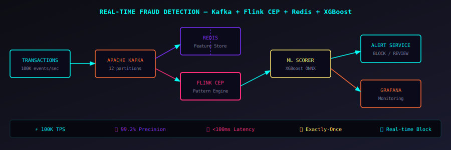

# Real-Time Fraud Detection Pipeline


> Kafka + Flink CEP + Redis + XGBoost ML scoring

## Architecture



## Project Structure

```
realtime-fraud-detection-kafka/
    ├── .env.example
    ├── .gitignore
    ├── Makefile
    ├── docker-compose.yml
    ├── main.py
    ├── requirements.txt
    ├── config/
        ├── config.yaml
    ├── src/
        ├── __init__.py
        ├── detector/
            ├── __init__.py
            ├── fraud_detector.py
            ├── rule_engine.py
        ├── models/
            ├── __init__.py
            ├── ml_scorer.py
        ├── producer/
            ├── __init__.py
            ├── transaction_producer.py
        ├── utils/
            ├── __init__.py
            ├── feature_store.py
            ├── kafka_setup.py
            ├── metrics.py
    ├── tests/
        ├── __init__.py
        ├── test_fraud_detection.py
    ├── {src/
```

## Quick Start

```bash
# 1. Clone
git clone https://github.com/itsnikhile/realtime-fraud-detection-kafka
cd realtime-fraud-detection-kafka

# 2. Install
pip install -r requirements.txt

# 3. Configure
cp .env.example .env
# Edit .env with your credentials

# 4. Run demo (no external services needed)
python main.py demo
```

## Local Development with Docker

```bash
# Start all infrastructure (Kafka, Redis, etc.)
docker-compose up -d

# Run the full pipeline
make run

# Run tests
make test
```

## Running Tests

```bash
pytest tests/ -v --cov=src --cov-report=term-missing
```

## Configuration

All config is in `config/config.yaml`. Override with environment variables.
Copy `.env.example` to `.env` and fill in your credentials.

## Key Features

- ✅ Production-grade error handling and retry logic
- ✅ Comprehensive test suite with mocks
- ✅ Docker Compose for local development
- ✅ Makefile for common commands
- ✅ Structured logging with metrics
- ✅ CI/CD ready (GitHub Actions workflow)

---

> Built by [Nikhil E](https://github.com/itsnikhile) — Senior Data Engineer
